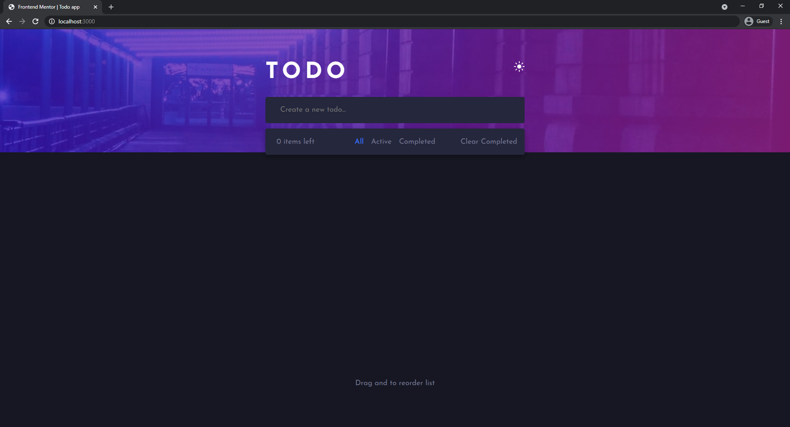

# Frontend Mentor - Todo app solution

This is a solution to the [Todo app challenge on Frontend Mentor](https://www.frontendmentor.io/challenges/todo-app-Su1_KokOW). Frontend Mentor challenges help you improve your coding skills by building realistic projects. 

## Table of contents

  - [The challenge](#the-challenge)
  - [Screenshot](#screenshot)
  - [Built with](#built-with)

### The challenge

Users should be able to:

- View the optimal layout for the app depending on their device's screen size
- See hover states for all interactive elements on the page
- Add new todos to the list
- Mark todos as complete
- Delete todos from the list
- Filter by all/active/complete todos
- Clear all completed todos
- Toggle light and dark mode
- **Bonus**: Drag and drop to reorder items on the list

### Screenshot

### Links
- Live Site URL: [Add live site URL here](https://your-live-site-url.com)

### Built with

- Semantic HTML5 markup
- SASS
- CSS custom properties
- [React](https://reactjs.org/) - JS library
- [react-dnd-beautiful](https://github.com/atlassian/react-beautiful-dnd) - React library

### Style Guide

# Layout

The designs were created to the following widths:

- Mobile: 375px
- Desktop: 1440px

# Colors

# Primary

- Bright Blue: hsl(220, 98%, 61%)
- Check Background: linear-gradient hsl(192, 100%, 67%) to hsl(280, 87%, 65%)

# Neutral

# Light Theme

- Very Light Gray: hsl(0, 0%, 98%)
- Very Light Grayish Blue: hsl(236, 33%, 92%)
- Light Grayish Blue: hsl(233, 11%, 84%)
- Dark Grayish Blue: hsl(236, 9%, 61%)
- Very Dark Grayish Blue: hsl(235, 19%, 35%)

# Dark Theme

- Very Dark Blue: hsl(235, 21%, 11%)
- Very Dark Desaturated Blue: hsl(235, 24%, 19%)
- Light Grayish Blue: hsl(234, 39%, 85%)
- Light Grayish Blue (hover): hsl(236, 33%, 92%)
- Dark Grayish Blue: hsl(234, 11%, 52%)
- Very Dark Grayish Blue: hsl(233, 14%, 35%)
- Very Dark Grayish Blue: hsl(237, 14%, 26%)

# Body Copy

- Font size: 18px

# Font

- Family: [Josefin Sans](https://fonts.google.com/specimen/Josefin+Sans)
- Weights: 400, 700

